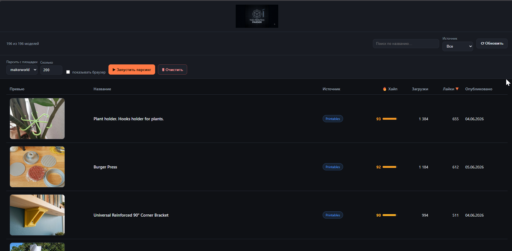
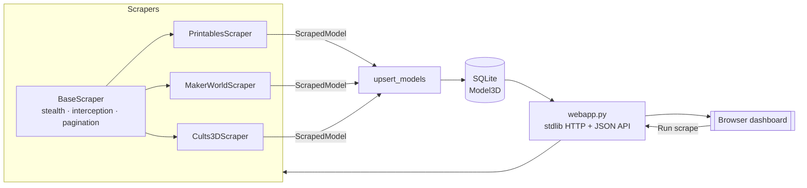

# The Printed Parser (TPP)

> A resilient, modular scraper for 3D-model marketplaces (Printables, MakerWorld,
> Cults3D, …) with a built-in web dashboard — designed to keep working even
> behind Cloudflare and SvelteKit/SPA front-ends.

[](https://github.com/KartaviiBro/The_printed_parser_TPP/actions/workflows/ci.yml)




---

## Why this project is interesting

Most "scrapers" break the moment a site changes its HTML. TPP is built around a
different idea: **don't parse the markup — read the data the site reads.**

- **Network interception over CSS selectors.** Instead of fighting changing
  class names, it intercepts the JSON/GraphQL the site's own front-end fetches,
  and deep-searches it for model objects. Resilient to redesigns.
- **Cloudflare-aware.** Launches a stealthed Playwright browser
  (`playwright-stealth` + realistic fingerprint) to pass passive bot checks; a
  `--headful` mode lets you solve interactive challenges once.
- **SvelteKit-aware.** Printables ships its list as a flattened *devalue*
  `__data.json`; TPP un-flattens that format back into objects.
- **Real pagination.** Replays the site's own paginated query (cursor / offset /
  page) to pull a large sample from the *whole* catalogue — not just page one.
- **Self-diagnosing.** If parsing ever yields nothing, the raw payloads are
  dumped to `data/debug/` so the real shape is one click away.

## Features

- 🧩 **Pluggable scrapers** — add a marketplace by subclassing `BaseScraper`.
- 🗄 **Source-agnostic storage** — one SQLite table keyed by `(source, external_id)`
  with clean upserts (re-scraping updates metrics, never duplicates).
- 🖥 **Zero-dependency web UI** — browse, search, sort and filter by source;
  trigger scrapes from the page with a live status; clear the table.
- 🔥 **"Hype" index** — a popularity score computed from downloads, likes and
  recency, with a colour-coded bar.
- 🪵 **Real-time logging** — see exactly what each scraper is doing.

## Architecture



| Layer | What it does |
| --- | --- |
| `scraper/base.py` | Browser lifecycle, stealth, JSON capture, pagination helpers, persistence |
| `scraper/<site>.py` | Per-platform logic — mostly just "find & normalise model objects" |
| `db/` | SQLAlchemy `Model3D` model + engine + `upsert_models` |
| `webapp.py` | Local dashboard: HTML + JSON API + background scrape jobs |
| `main.py` | CLI entry point |

## Tech stack

Python 3.11+ · Playwright + playwright-stealth · SQLAlchemy 2.0 · SQLite ·
stdlib HTTP dashboard + optional FastAPI/OpenAPI layer · pytest · ruff ·
GitHub Actions.

## Quick start

```bash
# 1. Install dependencies
python -m venv .venv
.venv/Scripts/activate            # Windows  (source .venv/bin/activate on *nix)
pip install -r requirements.txt

# 2. Install the Playwright browser (once)
playwright install chromium

# 3. Create the database
python init_db.py

# 4. Scrape a platform (headful is most reliable vs Cloudflare)
python main.py printables --headful --limit 100

# 5. Open the dashboard
python webapp.py                  # http://127.0.0.1:8000
```

CLI options:

```bash
python main.py --list                  # list registered platforms
python main.py --all --limit 100       # scrape every platform
python main.py makerworld --debug      # verbose logging
```

## Run with Docker

The image is based on the official Playwright image (Chromium + deps included),
so no local browser install is needed:

```bash
docker compose up --build      # dashboard at http://127.0.0.1:8000
```

The SQLite database is persisted in `./data`. Scrapes triggered from the
dashboard run **headless** inside the container — great for MakerWorld/Cults3D.
Sites with interactive Cloudflare challenges (occasionally Printables) are best
scraped locally with `--headful` so you can solve a challenge once.

## Using the dashboard

- **▶ Запустить парсинг** — pick a platform + count, run a scrape live (a
  notification shows progress; the table refreshes when done).
- **🗑 Очистить** — clear all rows, or only the source selected in the filter.
- Sort by any column (default: 🔥 Hype), search by title, filter by source.
- **📈** on any row — expand a time-series sparkline of its downloads/likes.
- **⬇ CSV** — export the current (filtered/searched) view; also available as
  `GET /api/export.csv` and `/api/export.json` (with `?source=` / `?q=`).

## REST API (optional)

Alongside the lightweight dashboard there's a typed **FastAPI** layer with
auto-generated **OpenAPI/Swagger** docs:

```bash
pip install -r requirements-api.txt
uvicorn api:app --reload          # interactive docs at http://127.0.0.1:8000/docs
```

| Endpoint | Description |
| --- | --- |
| `GET /sources` | Registered platforms |
| `GET /models?source=&q=&limit=&offset=` | List / filter / paginate models |
| `GET /models/{id}` | A single model |
| `GET /models/{id}/history` | Metric time-series |
| `GET /export.csv?source=&q=` | CSV download |

## Adding a new platform

```python
# scraper/myplatform.py
from scraper.base import BaseScraper, ScrapedModel, deep_find

class MyPlatformScraper(BaseScraper):
    source = "myplatform"

    async def scrape(self, limit: int = 100) -> list[ScrapedModel]:
        async with self.browser_context() as ctx:
            page = await ctx.new_page()
            payloads = await self.collect_api_json(
                page, "https://example.com/popular",
                lambda url: "/api/" in url,
            )
        models = []
        for d in deep_find(payloads, lambda x: "id" in x and "title" in x):
            models.append(ScrapedModel(
                source=self.source, external_id=str(d["id"]),
                title=d["title"], source_url=f"https://example.com/m/{d['id']}",
            ))
        return models[:limit]
```

Then register it in `scraper/__init__.py` — it appears in the CLI and UI
automatically.

## Tests & CI

```bash
pip install -r requirements-dev.txt
ruff check .      # lint
pytest            # unit tests (no network/browser needed)
```

The pure logic — devalue un-flattening, cursor pagination, model detection,
normalisation, upserts — is unit-tested. CI runs lint + tests on every push
(see [`.github/workflows/ci.yml`](.github/workflows/ci.yml)).

## Roadmap

- [x] Tests + CI
- [x] Docker / docker-compose one-command run
- [x] Metric history (`metric_snapshots`) → real trending charts
- [x] CSV / JSON export (filtered)
- [x] FastAPI REST layer with OpenAPI docs
- [ ] Detail-page enrichment (print time, material, weight)

## Note on responsible scraping

This project is for learning and personal research. Respect each site's Terms of
Service and `robots.txt`, scrape at a reasonable rate, and don't redistribute
copyrighted model files.
